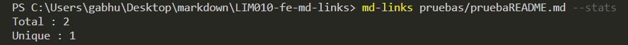

# Markdown Links

> Analizador de archivos markdown para verificar los links que contengan y reportar algunas estadísticas. .Rápido y fácil de entender.


[Diagrama de flujo](https://drive.google.com/file/d/1BBQHY5kM_BQ-CTUdC4QG7MyVUFJwIIRL/view?usp=sharing)

[Board con el backlog](https://github.com/gabhu-dev/LIM010-fe-md-links/projects/1)

## Guía de uso e instalación de la librería

### Instalar en la terminal

```bash
npm install --global gabhu-dev/md-links
```

### USO

### CLI (Command Line Interface - Interfaz de Línea de Comando)

El ejecutable debe poder ejecutarse de la siguiente
manera a través de la terminal:

`md-links <path-to-file> [options]`

Por ejemplo:

```sh
$ md-links ./some/example.md
./some/example.md http://algo.com/2/3/ Link a algo
./some/example.md https://otra-cosa.net/algun-doc.html algún doc
./some/example.md http://google.com/ Google
```

El comportamiento por defecto 
solo identifica el archivo markdown (a partir de la ruta que recibe como
argumento), analizar el archivo Markdown e imprimir los links que vaya
encontrando, junto con la ruta del archivo donde aparece y el texto
que hay dentro del link (truncado a 50 caracteres).

#### Options

##### `--validate`

Si pasamos la opción `--validate`, verifica si los links funcionan o no.

Por ejemplo:


Vemos que el _output_ en este caso incluye la palabra `ok` o `fail` después de
la URL, así como el status de la respuesta recibida a la petición HTTP a dicha
URL.

##### `--stats`

Si pasamos la opción `--stats` el output (salida) será un texto con estadísticas
básicas sobre los links.




También podemos combinar `--stats` y `--validate` para obtener estadísticas que
necesiten de los resultados de la validación.


## Objetivos de aprendizaje

Recuerda colocar en esta seccion los objetivos de aprendizaje que quedaron 
pendientes de tu proyecto anterior.

### Javascript
- [x] Uso de callbacks
- [x] Consumo de Promesas
- [x] Creacion de Promesas
- [x] Modulos de Js
- [x] Recursión

### Node
- [x] Sistema de archivos
- [x] package.json
- [x] crear modules
- [x] Instalar y usar modules
- [x] npm scripts
- [x] CLI (Command Line Interface - Interfaz de Línea de Comando)

### Testing
- [x] Testeo de tus funciones
- [x] Testeo asíncrono
- [x] Uso de librerias de Mock
- [x] Mocks manuales
- [x] Testeo para multiples Sistemas Operativos

### Git y Github
- [x] Organización en Github

### Buenas prácticas de desarrollo
- [x] Modularización
- [x] Nomenclatura / Semántica
- [x] Linting


