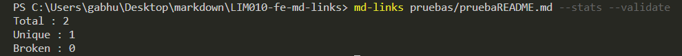

# Markdown Links
[](https://travis-ci.org/markdown-it/markdown-it)
[](https://www.npmjs.org/package/markdown-it)
[](https://coveralls.io/github/markdown-it/markdown-it?branch=master)

> Analizador de archivos markdown para verificar los links que contengan y reportar algunas estadísticas. .Rápido y fácil de entender.


[Diagrama de flujo](https://drive.google.com/file/d/1BBQHY5kM_BQ-CTUdC4QG7MyVUFJwIIRL/view?usp=sharing)

[Board con el backlog](https://github.com/gabhu-dev/LIM010-fe-md-links/projects/1)

## Guía de uso e instalación de la librería

- Instalar la libreria

```bash
npm install --global <github-user>/md-links
```

- Uso
#### `mdLinks(path, options)`

### CLI (Command Line Interface - Interfaz de Línea de Comando)

El ejecutable de nuestra aplicación debe poder ejecutarse de la siguiente
manera a través de la terminal:

`md-links <path-to-file> [options]`

Por ejemplo:

```sh
$ md-links ./some/example.md
./some/example.md http://algo.com/2/3/ Link a algo
./some/example.md https://otra-cosa.net/algun-doc.html algún doc
./some/example.md http://google.com/ Google
```

El comportamiento por defecto no debe validar si las URLs responden ok o no,
solo debe identificar el archivo markdown (a partir de la ruta que recibe como
argumento), analizar el archivo Markdown e imprimir los links que vaya
encontrando, junto con la ruta del archivo donde aparece y el texto
que hay dentro del link (truncado a 50 caracteres).

#### Options

##### `--validate`

Si pasamos la opción `--validate`, verifica si los links funcionan o no.

Por ejemplo:


Vemos que el _output_ en este caso incluye la palabra `ok` o `fail` después de
la URL, así como el status de la respuesta recibida a la petición HTTP a dicha
URL.

##### `--stats`

Si pasamos la opción `--stats` el output (salida) será un texto con estadísticas
básicas sobre los links.


También podemos combinar `--stats` y `--validate` para obtener estadísticas que
necesiten de los resultados de la validación.



## Objetivos de aprendizaje

Recuerda colocar en esta seccion los objetivos de aprendizaje que quedaron 
pendientes de tu proyecto anterior.

### Javascript
- [ ] Uso de callbacks
- [ ] Consumo de Promesas
- [ ] Creacion de Promesas
- [ ] Modulos de Js
- [ ] Recursión

### Node
- [ ] Sistema de archivos
- [ ] package.json
- [ ] crear modules
- [ ] Instalar y usar modules
- [ ] npm scripts
- [ ] CLI (Command Line Interface - Interfaz de Línea de Comando)

### Testing
- [ ] Testeo de tus funciones
- [ ] Testeo asíncrono
- [ ] Uso de librerias de Mock
- [ ] Mocks manuales
- [ ] Testeo para multiples Sistemas Operativos

### Git y Github
- [ ] Organización en Github

### Buenas prácticas de desarrollo
- [ ] Modularización
- [ ] Nomenclatura / Semántica
- [ ] Linting

***

## Pistas / Tips

### FAQs

#### ¿Cómo hago para que mi módulo sea _instalable_ desde GitHub?

Para que el módulo sea instalable desde GitHub solo tiene que:

- Estar en un repo público de GitHub
- Contener un `package.json` válido

Con el comando `npm install githubname/reponame` podemos instalar directamente
desde GitHub. Ver [docs oficiales de `npm install` acá](https://docs.npmjs.com/cli/install).

Por ejemplo, el [`course-parser`](https://github.com/Laboratoria/course-parser)
que usamos para la currícula no está publicado en el registro público de NPM,
así que lo instalamos directamente desde GitHub con el comando `npm install
Laboratoria/course-parser`.

### Sugerencias de implementación

La implementación de este proyecto tiene varias partes: leer del sistema de
archivos, recibir argumentos a través de la línea de comando, analizar texto,
hacer consultas HTTP, ... y todas estas cosas pueden enfocarse de muchas formas,
tanto usando librerías como implementando en VanillaJS.

Por poner un ejemplo, el _parseado_ (análisis) del markdown para extraer los
links podría plantearse de las siguientes maneras (todas válidas):

- Usando un _módulo_ como [markdown-it](https://github.com/markdown-it/markdown-it),
  que nos devuelve un arreglo de _tokens_ que podemos recorrer para identificar
  los links.
- Siguiendo otro camino completamente, podríamos usar
  [expresiones regulares (`RegExp`)](https://developer.mozilla.org/es/docs/Web/JavaScript/Guide/Regular_Expressions).
- También podríamos usar una combinación de varios _módulos_ (podría ser válido
  transformar el markdown a HTML usando algo como [marked](https://github.com/markedjs/marked)
  y de ahí extraer los link con una librería de DOM como [JSDOM](https://github.com/jsdom/jsdom)
  o [Cheerio](https://github.com/cheeriojs/cheerio) entre otras).
- Usando un _custom renderer_ de [marked](https://github.com/markedjs/marked)
  (`new marked.Renderer()`).

No dudes en consultar a tus compañeras, coaches y/o el [foro de la comunidad](http://community.laboratoria.la/c/js)
si tienes dudas existenciales con respecto a estas decisiones. No existe una
"única" manera correcta :wink:

### Tutoriales / NodeSchool workshoppers

- [learnyounode](https://github.com/workshopper/learnyounode)
- [how-to-npm](https://github.com/workshopper/how-to-npm)
- [promise-it-wont-hurt](https://github.com/stevekane/promise-it-wont-hurt)

### Otros recursos

- [Acerca de Node.js - Documentación oficial](https://nodejs.org/es/about/)
- [Node.js file system - Documentación oficial](https://nodejs.org/api/fs.html)
- [Node.js http.get - Documentación oficial](https://nodejs.org/api/http.html#http_http_get_options_callback)
- [Node.js - Wikipedia](https://es.wikipedia.org/wiki/Node.js)
- [What exactly is Node.js? - freeCodeCamp](https://medium.freecodecamp.org/what-exactly-is-node-js-ae36e97449f5)
- [¿Qué es Node.js y para qué sirve? - drauta.com](https://www.drauta.com/que-es-nodejs-y-para-que-sirve)
- [¿Qué es Nodejs? Javascript en el Servidor - Fazt en YouTube](https://www.youtube.com/watch?v=WgSc1nv_4Gw)
- [¿Simplemente qué es Node.js? - IBM Developer Works, 2011](https://www.ibm.com/developerworks/ssa/opensource/library/os-nodejs/index.html)
- [Node.js y npm](https://www.genbeta.com/desarrollo/node-js-y-npm)
- [Módulos, librerías, paquetes, frameworks... ¿cuál es la diferencia?](http://community.laboratoria.la/t/modulos-librerias-paquetes-frameworks-cual-es-la-diferencia/175)
- [Asíncronía en js](https://carlosazaustre.com/manejando-la-asincronia-en-javascript/)
- [NPM](https://docs.npmjs.com/getting-started/what-is-npm)
- [Publicar packpage](https://docs.npmjs.com/getting-started/publishing-npm-packages)
- [Crear módulos en Node.js](https://docs.npmjs.com/getting-started/publishing-npm-packages)
- [Leer un archivo](https://nodejs.org/api/fs.html#fs_fs_readfile_path_options_callback)
- [Leer un directorio](https://nodejs.org/api/fs.html#fs_fs_readdir_path_options_callback)
- [Path](https://nodejs.org/api/path.html)
- [Linea de comando CLI](https://medium.com/netscape/a-guide-to-create-a-nodejs-command-line-package-c2166ad0452e)
- [Promise](https://javascript.info/promise-basics)
- [Comprendiendo Promesas en Js](https://hackernoon.com/understanding-promises-in-javascript-13d99df067c1)
- [Pill de recursión - video](https://www.youtube.com/watch?v=lPPgY3HLlhQ&t=916s)
- [Pill de recursión - repositorio](https://github.com/merunga/pildora-recursion)
